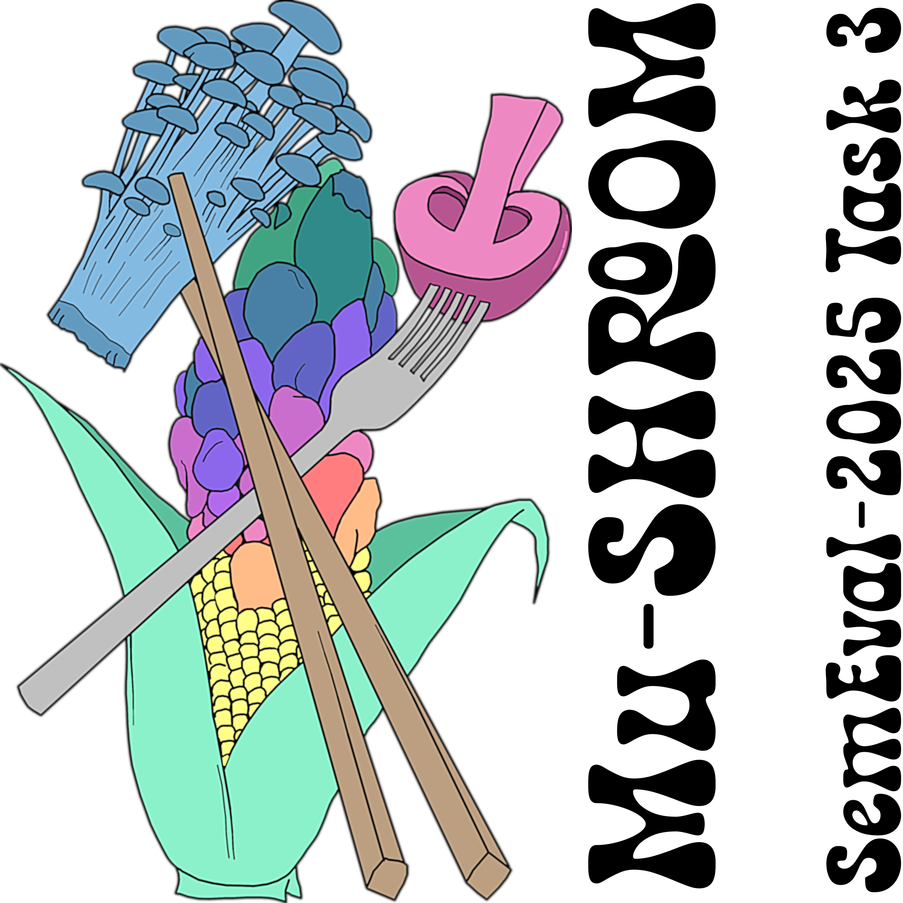

# projects

  

## UN-SHROOM: Using NLI to Search for Hallucinations and Related Observable Overgeneration Mistakes [pdf↗]
- December 2024
- Final research project for CSCI 375 NLP

  

  

## 中國社會信用體系的現狀和評價 (The Current State and Opinions of China's Social Credit System) [[pdf↗](./assets/docs/NathanielTunggal-ChinaSCS.pdf)]
- May 2024
- Capstone research project for CHIN 402